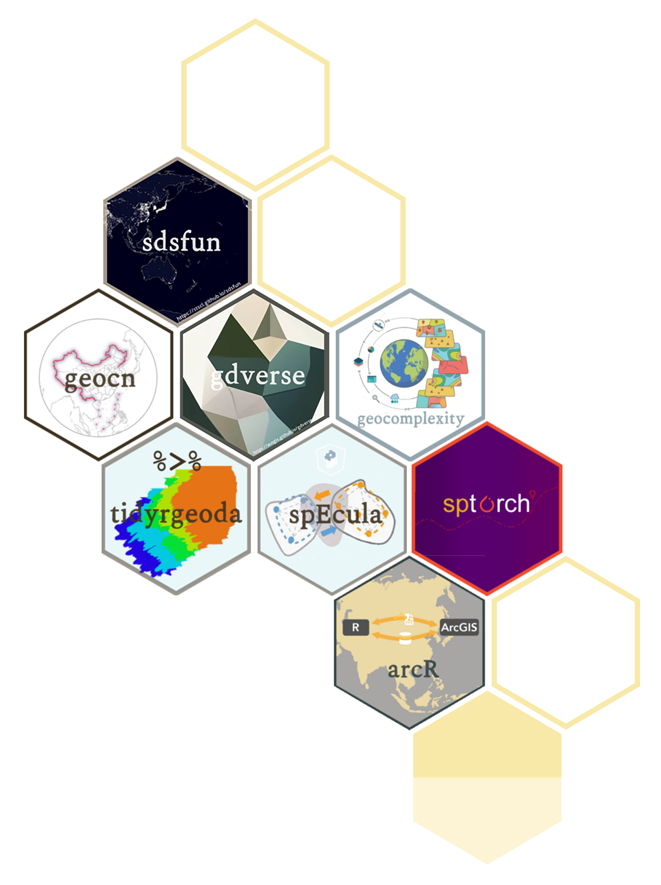
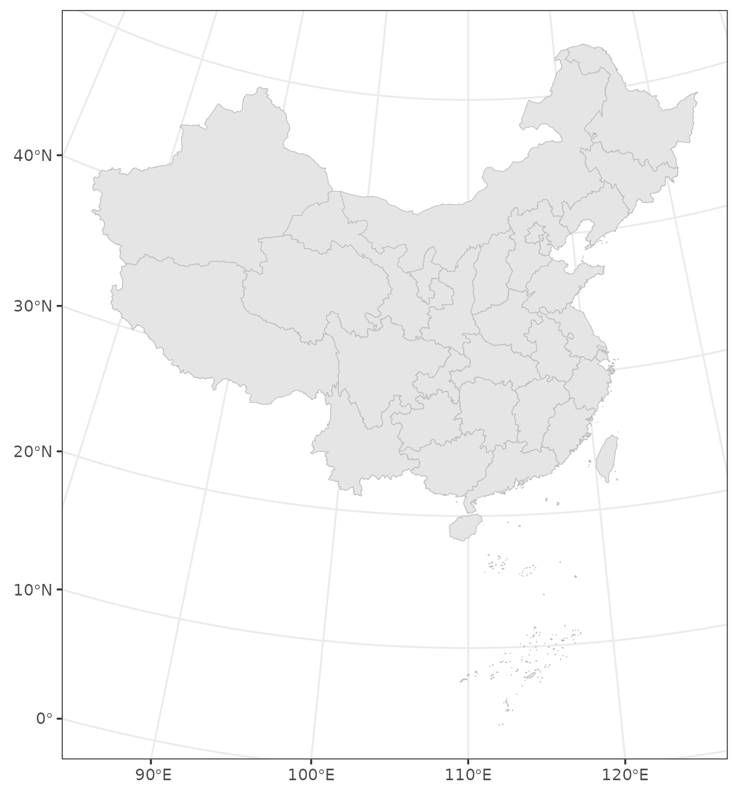

class: title-slide

```{r setup, include = FALSE}
knitr::opts_chunk$set(echo = TRUE,
                      dpi = 600,
                      warning = FALSE,
                      message = FALSE,
                      out.width = "100%",
                      out.height = "400px",
                      fig.align = 'center',
                      comment = "##",
                      htmltools.dir.version = FALSE)
```

```{css,echo=FALSE}
@import url(https://fonts.googleapis.com/css?family=Inconsolata);
@import url('https://fonts.googleapis.com/css?family=Roboto+Condensed:300,300i,600');
@import url('https://fonts.googleapis.com/css?family=Roboto:600');

body {
  font-family: 'Roboto Condensed', 'Avenir Next', 'Helvetica Neue', 'Helvetica', sans-serif;
  font-weight: 300;
}
h1, h2, h3 {
  font-family: 'Roboto', 'Avenir Next', 'Helvetica Neue', 'Helvetica', sans-serif;
  font-weight: 600;
}
.remark-code, .remark-inline-code { 
font-family: 'Inconsolata', 'Consolas', Monaco, monospace; 
}

.title-slide {
  background-image: url("https://spatlyu.github.io/materials/figures/ausgis_ppt_title_bg1.png");
  background-position: center;
  background-size: contain;
}
```

---
class: inverse, middle, center
background-image: url("https://spatlyu.github.io/materials/figures/ausgis_ppt_title_bg3.png")
background-position: center
background-size: contain

# R Learning materials

---
background-image: url("https://spatlyu.github.io/materials/figures/ausgis_ppt_title_bg4.png")
background-position: center
background-size: contain

--

.pull-left[

#### [<span style="color: #5b7b75;display: block;margin-top: 120px;"> Geocomputation with R </span>](https://r.geocompx.org/)

#### [<span style="color: #5b7b75;"> Spatial Data Science With Applications in R </span>](https://r-spatial.org/book/)

#### [<span style="color: #5b7b75;"> Spatial data with terra </span>](https://rspatial.org/spatial/index.html)

#### [<span style="color: #5b7b75;"> Introduction to BaseR </span>](https://rspatial.org/intr/)

#### [<span style="color: #5b7b75;"> Advanced R </span>](https://adv-r.hadley.nz/)

#### [<span style="color: #5b7b75;"> R for Data Science (2e) & tidyverse </span>](https://r4ds.hadley.nz/)

#### [<span style="color: #5b7b75;"> Unofficial Rcpp Api Documentation </span>](https://thecoatlessprofessor.com/programming/cpp/unofficial-rcpp-api-documentation/)

]

--

.pull-right[
## <span style="display: block;margin-top: 150px;">For the full version of resource recommendations, please refer to [my blog](https://spatlyu.github.io/posts/r-books/).</span>
]

---
class: inverse, middle, center
background-image: url("https://spatlyu.github.io/materials/figures/ausgis_ppt_title_bg3.png")
background-position: center
background-size: contain

# R packages developed by Wenbo Lv and his partners

---
background-image: url("https://spatlyu.github.io/materials/figures/ausgis_ppt_title_bg4.png")
background-position: center
background-size: contain

--

.pull-left[

## <span style="color: #4472c4;display: block;margin-top: 70px;"> Content</span>

#### Geospatial Data of China

- [geocn](https://stscl.github.io/geocn/)

#### Geospatial Processing

- [qgisprocess](https://r-spatial.github.io/qgisprocess/)

- [Rsagacmd](https://stevenpawley.github.io/Rsagacmd/)

#### Geospatial Methods

- [sdsfun](https://stscl.github.io/sdsfun/)

- [gdverse](https://ausgis.github.io/gdverse/)

- [geocomplexity](https://ausgis.github.io/geocomplexity/)

]

--

.pull-right[
```{r echo=FALSE,out.width="80%",out.height="50%",fig.align='center'}

```
]

---
class: inverse, middle, center
background-image: url("https://spatlyu.github.io/materials/figures/ausgis_ppt_title_bg3.png")
background-position: center
background-size: contain

# Tutorials for My Open Source Geospatial Packages

---
background-image: url("./assets/pkgs.jpg")
background-position: center
background-size: contain

--

.pull-left[

## <span style="color: #4472c4;display: block;margin-top: 70px;"> [geocn](https://stscl.github.io/geocn/)</span>

#### Loads Spatial Data Sets of China

```r
library(sf)
library(geocn)
library(ggplot2)

albers = load_cn_alberproj()
province = load_cn_province()
province_albers = st_transform(province,albers)
ggplot(data = province_albers) +
  geom_sf(fill = 'grey90', color = 'grey') +
  theme_bw()
```

]

--

.pull-right[

]

---
class: center, middle
background-image: url("https://spatlyu.github.io/materials/figures/ausgis_ppt_title_bg3.png")
background-position: center
background-size: contain

# Thanks

### Wenbo Lv

### lyu.geosocial@gmail.com